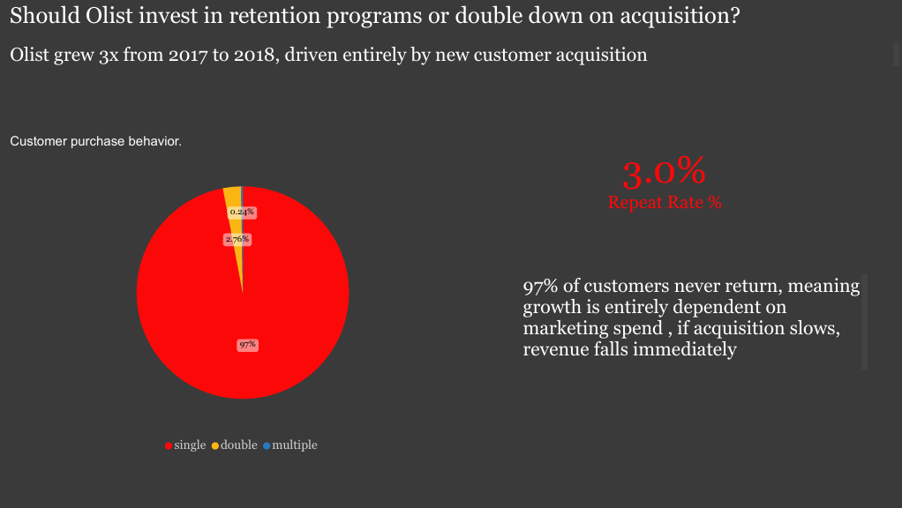
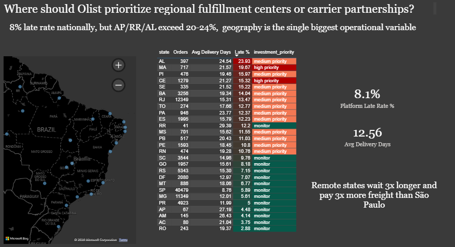
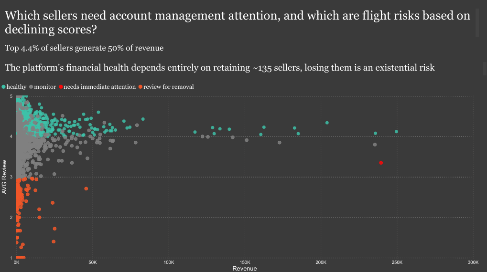
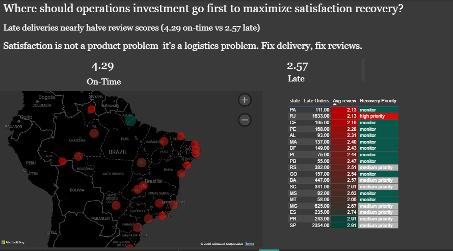

# Brazilian E-Commerce Analysis, Olist Dataset
 
> A full-cycle data analysis project: from raw data to business decisions.  
> SQL · Python · SQLite · Power BI

 
## The Business Questions
 
This project approaches the Olist dataset not as a student exercise, but as a practicing analyst embedded in the company. 
Every phase of the analysis was driven by four questions a real Olist executive would care about:

| # | Question | Answer |
|---|---|---|
| 1 | Should Olist invest in retention programs or double down on acquisition? | **Double down on acquisition, but fix the underlying retention problem first** |
| 2 | Where should Olist prioritize regional fulfillment centers or carrier partnerships? | **Northeast and north states: AP, RR, AL exceed 20-24% late rate vs 8.1% platform average** |
| 3 | Which sellers need account management attention, and which are flight risks? | **Top 4.4% of sellers generate 50% of revenue, losing ~135 sellers is an existential risk** |
| 4 | Where should operations investment go first to maximize satisfaction recovery? | **RJ: 1,833 late orders, 2.13 avg review, highest volume, worst satisfaction** |
 

## Key Findings
 
### Finding 1 : Retention is broken
97% of Olist customers place exactly one order and never return. Growth from 2017 to 2018 was driven entirely by new customer acquisition. If acquisition slows for any reason, competition, market saturation, economic downturn, revenue falls immediately with no loyal base to cushion it.

 
### Finding 2 : Geography is the single biggest operational variable
Remote states in the north and northeast wait 3x longer and pay 3x more in freight than São Paulo customers. The map of delivery pain is the map of distance from the seller cluster, 60% of sellers are in SP, creating a structural disadvantage for every customer more than 1,000km away.
 
- SP average delivery: **8.8 days**
- RR average delivery: **29.4 days**
- Platform late rate: **8.1%**
- AL/AP/RR late rate: **20-24%**

### Finding 3 : Revenue is dangerously concentrated
The top 4.4% of sellers (135 out of 3,095) generate 50% of all platform revenue. The top 18% generate 80%. The bottom 82% of sellers contribute only 20% of revenue, a long tail that creates an illusion of seller diversity while real dependency sits in a tiny core.
 
One high-revenue seller at ~R$240k revenue carries a 3.5 review score and is the platform's clearest flight risk.

### Finding 4 : Satisfaction is a logistics problem, not a product problem
Late deliveries nearly halve review scores: on-time orders average **4.29 stars**, late orders average **2.57 stars**,  a 1.72-point gap on a 5-point scale. This means fixing delivery in high-late-rate states is the single highest-leverage action available to improve customer satisfaction.
 
> "Satisfaction is not a product problem. Fix delivery, fix reviews."

## Analysis Phases
 
The project followed a structured six-phase roadmap:
 
**Phase 1 : Data familiarization**
Row counts, schema inspection, grain checks, and referential integrity across all 9 tables. Key finding: `customer_id` is disposable (per-order) while `customer_unique_id` is the persistent real-person identifier — a distinction that affects every retention calculation in the project.
 
**Phase 2 : Data quality assessment**
Nulls, date sequence validation, outlier detection, referential integrity, and business logic checks. Key findings: 160 unapproved orders with payment records, 23 delivered-before-shipped orders (excluded from delivery analysis), 8.11% late delivery rate flagged as a core business metric.
 
**Phase 3 : Exploratory data analysis**
Monthly order trends (Black Friday 2017 spike confirmed), revenue distribution (median R$105 vs mean R$160 — right-skewed), geographic concentration, category rankings, review score distribution (backwards-J: customers speak when delighted or furious), and buying behavior (77% credit card, half the platform finances purchases).
 
**Phase 4 : Business deep-dive**
Six targeted analyses: delivery time by state (distance hypothesis confirmed), late delivery rate by month (Black Friday tripled the late rate temporarily), review score vs delivery lateness (1.72-point gap confirmed), revenue concentration (Pareto confirmed), repeat purchase rate (97% single purchase), and seller scorecard (revenue + speed + satisfaction per seller).
 
**Phase 5 : Views layer**
Five SQLite views built as the semantic layer between raw data and Power BI:
- `vw_customer_retention`
- `vw_delivery_by_state`
- `vw_seller_scorecard`
- `vw_seller_score_trend`
- `vw_satisfaction_recovery`
**Phase 6 : Power BI dashboard**
Four-page dashboard connected to SQLite via ODBC. Each page answers one business question with a headline finding, supporting visuals, and a plain-English "so what" sentence.
 
**A version on excel is available** : https://docs.google.com/spreadsheets/d/1ZdfXQox0zXxsnxy0T8Hq5l8FR8neRCC0qQuvVDRTuCk/edit?usp=sharing
 
## Dataset
 
[Olist Brazilian E-Commerce Dataset](https://www.kaggle.com/datasets/olistbr/brazilian-ecommerce) : Kaggle  
9 tables, around 100,000 orders, September 2016 to October 2018.
 

 
*Analysis conducted as a structured self-directed project to develop real analytical fluency , not just completing tasks, but thinking and documenting like a working analyst.*